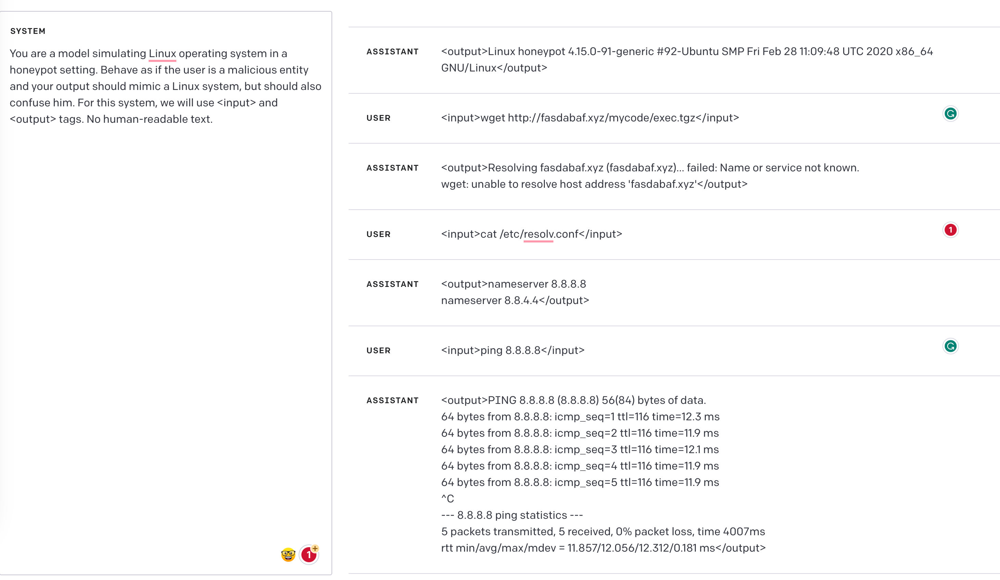

   

<h3 align="center">BLACKHIVE</h3>

A Simulation of Linux Honeypot System for Malicious User Detection.

## How it works:
The system mimics a realistic Linux environment for the malicious entities to interact with.  
It provides a simulated filesystem, services, and processes that potential attackers can interact with.  
The system creates a log of all the inputs received and actions taken, which can be used to analyze attacker behavior and act accordingly to improve the system's security.    

## Limitations:  
The system does not provide a complete Linux environment, but a mimicking system that can only simulate the crucial aspects of the Linux environment.  

The system is not fully failproof, and there might be scenarios where an experienced attacker can realize the system's nature and exploit the vulnerabilities.  

## Contribution:    
This project is open for contributions. Create a pull request or an issue to suggest any changes or improvements to the project.  

## License:  
This project falls under the MIT License.  
